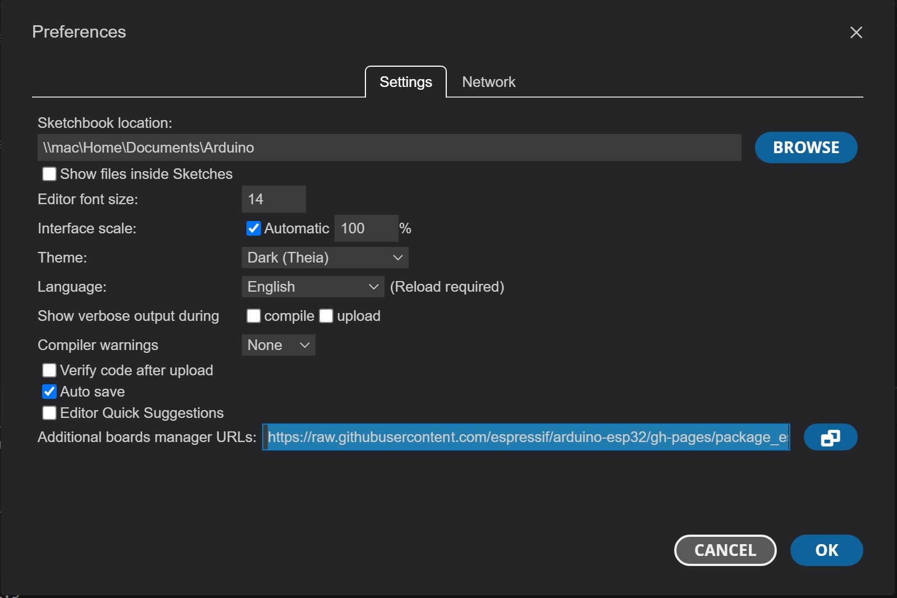
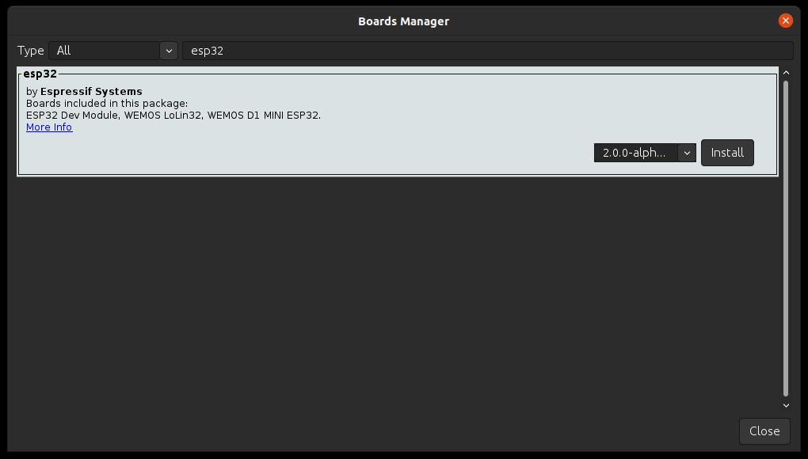
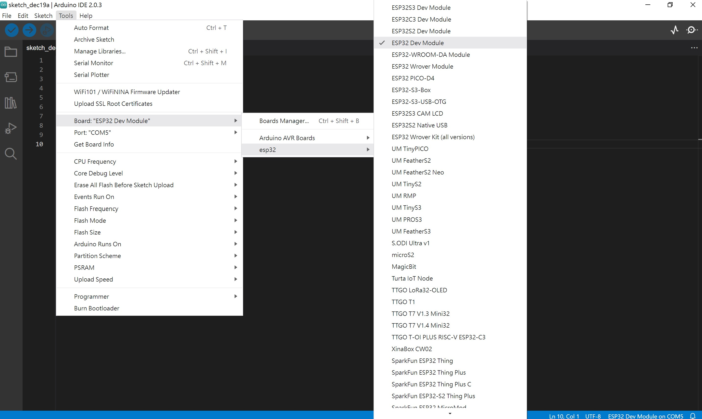
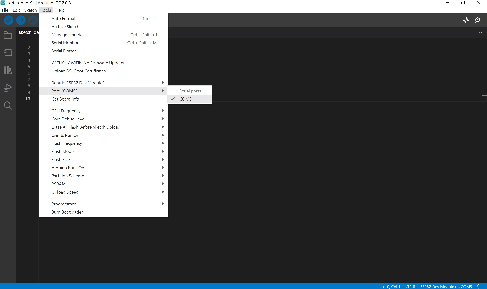
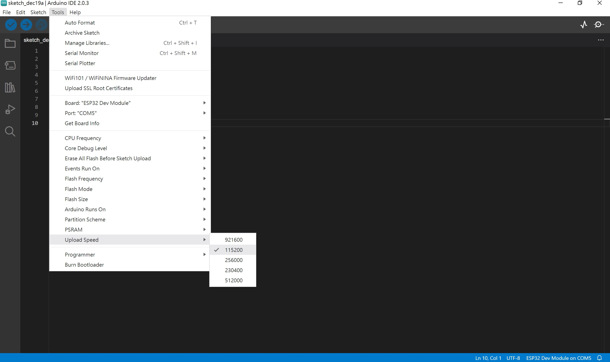

1.Installing Matrix310 using Arduino IDE
===
Arduino IDE can be downloaded from https://www.arduino.cc/en/software    

1.1 To start the installation process using the Boards Manager, follow these steps:  
+ Start the Arduino IDE and open the Preferences window.  
  

+ Enter the release links below into *Additional Board Manager URLs* field. You can add multiple URLs, separating them with commas.  
+ Stable release link:  
`https://raw.githubusercontent.com/espressif/arduino-esp32/gh-pages/package_esp32_index.json `  
+ Open Boards Manager from Tools > Board menu and install esp32 platform (and do not forget to select your ESP32 board from Tools > Board menu after installation).  

+ Restart Arduino IDE.  
  
1.2 To Configure the Arduino IDE, follow these steps:  
+ Connect the Matrix310 to your computer's USB port.  
+ Select the Board from Tools > Board > esp32 > ESP32 Dev Module
  

+ Select the Port from Tools > Port > COM Port
  

+ Change the Upload Speed to 115200 from Tools > Upload Speed > 115200
  
+ Start your application.  
  
1.3 Verify and Upload the example sketch with Arduino IDE

