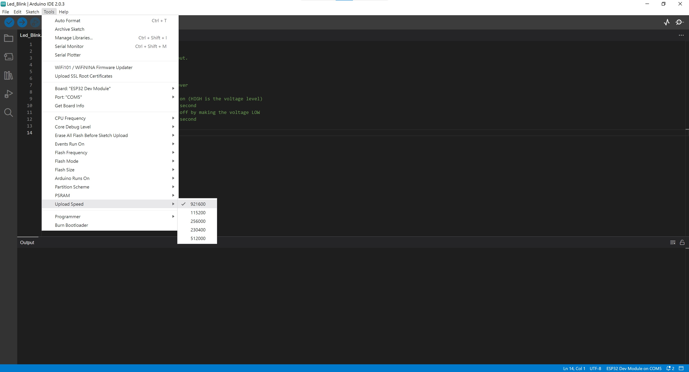

1.Installing Matrix310 using Arduino IDE
===
Arduino IDE can be downloaded from https://www.arduino.cc/en/software    

1.1 To start the installation process using the Boards Manager, follow these steps:  
+ Start the Arduino IDE and open the Preferences window.  
  

+ Enter the release links below into *Additional Board Manager URLs* field. You can add multiple URLs, separating them with commas.  
+ Stable release link:  
`https://raw.githubusercontent.com/espressif/arduino-esp32/gh-pages/package_esp32_index.json `  
+ Open Boards Manager from Tools > Board menu and install esp32 platform (and do not forget to select your ESP32 board from Tools > Board menu after installation).  

+ Restart Arduino IDE.  
  
1.2 To Configure the Arduino IDE, follow these steps:  
+ Connect the Matrix310's Micro USB/serial console to your computer's USB port.  
+ Select the Board from Tools > Board > esp32 > ESP32 Dev Module
  

+ Select the Port from Tools > Port > COM Port
  

+ Change the Upload Speed to 921600 from Tools > Upload Speed > 921600(若error就降速)
  
+ Start your application.  
  
1.3 Verify and Upload the example sketch with Arduino IDE  
+ Open the example sketch from File > Sketchbook > generated_examples.  
+ Click **Verify** button to verify the example sketch.  
  

+ Click **Upload** button to upload the example sketch.  
  
+ Wait for the sketch upload completed.  
  
1.4 Open the Serial Monitor  
  
+ You can use the Arduino environment’s built-in serial monitor to communicate with Matrix310. Click the serial monitor button in the toolbar and select the same baud rate used in the call to ```begin()```.  
  

2.Setup Ready LED
===

3.Setup Ethernet LAN
===

4.Setup WIFI
===

5.Setup SD Card
===

6.Setup RS232
===

7.Setup RS485
===

8.Setup Digital Input / Digital Output
===

9.To store file in flash memory with SPIFFS
===


